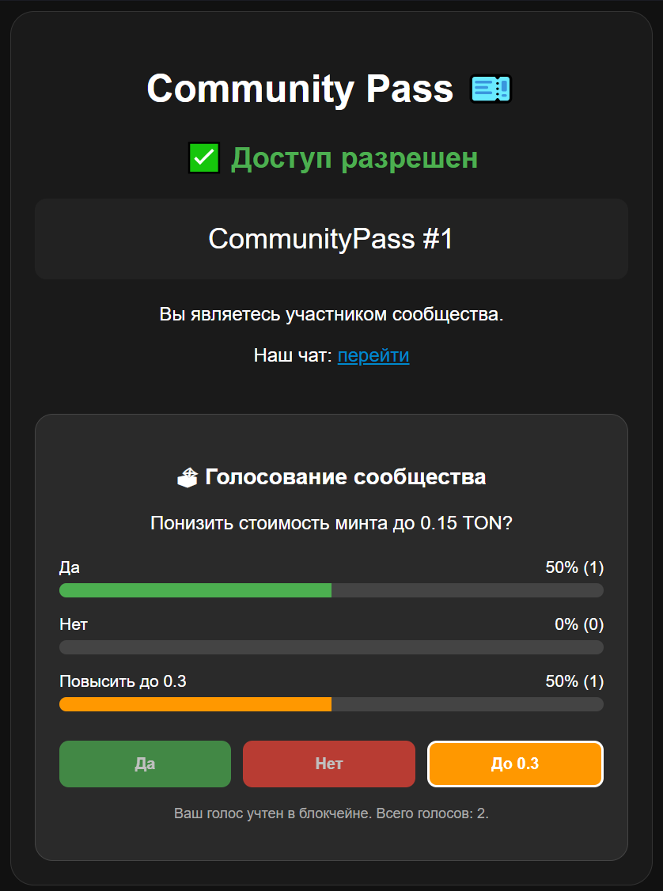

# TON Community Pass

Приложение доступно по адресу: https://community.antislang.com

Функции:
- Авторизация с помощью TON Connect
- Минт NFT - пропуска в сообщество
- При наличии NFT открывается доступ в сообщество, где доступна ссылка на Telegram-чат и...
- DAO-voting - честное голосование: участники сообщества могут участвовать в опросах, а их голоса записываются напрямую в блокчейн

Стек: React (@tonconnect/ui-react) + TypeScript, Tact для написания смарт-контрактов

Взаимодействие с TON: TonAPI v2 (REST)

Для запуска своей копии:
- Установить Node.js
- Задеплоить свой контракт в папке contracts-env: `npm blueprint build` & `npm blueprint run`
- Указать полученный адрес контракта в фронте
- Запустить фронт: `npm run dev`